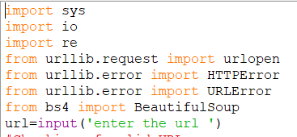

# opengenus_internship_task
Completing this assignment was a fruitful experience bestowed on me by OpenGenus Foundation while internship screening task.After completing this project i came to know about various python libraries and this project also enhances my knowledge a lot.

The task provided to me was-

To develop a script in any language which will take a URL as an input and output the following information:
1)Size of the webpage in bytes
2)Number of links in that page pointing to same domain (find <a> tags)
  
The basic idea behind this process is to gain the information about a webpage with the help of a URL and this can be achieved in several ways some are:
1)Using Web Scraping
2)Using Socket programing(API)

Here I am using first method rather than second because many times the API are not present or for that purpose we have to rely on third parties ;besides there are certain strict rules on the data that is sent or returned in JSON.

i)Now we first check for the valid URL using regular expression.

ii)We also need to make sure that while requesting for a web page , we don't get errors and if we get then display error messages efficiently(HTTPError,URLError,etc..)

iii)For finding the size of webpage in bytes ,we use sys module in python and then by .getsizeof() we find the size of the webpage in text format.

iv)For finding the links on the webpage to the same domain we have used BeautifulSoup ,a python library ,to find all <a> tags that have links to the same domain ,ie, href="/" or href="same webpage url " and count the result in c (we could also have used str.count approach)
 
 Steps invloves in completing this task with screenshot:
 
 
